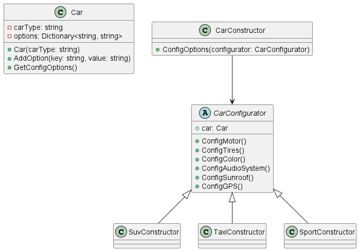
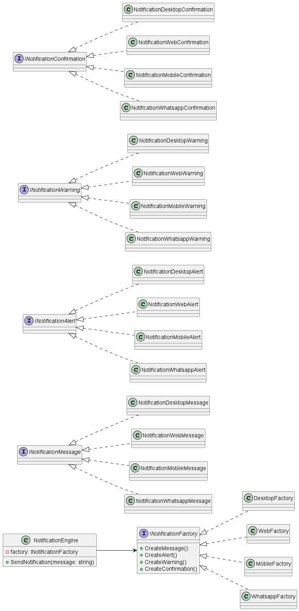

## TALLER PATRONES DE DISEÑO
##### _David Ramiro Quitora Cubillos_
##### _Jonathan Villamizar Ochoa_
##### _Leonel Fernando Ballesteros Ahumada_
##### _Luis Fabian Gutierrez Valderrama_
------

### Escenario 1
- Patrón Creacional -> BUILDER
- [Codigo fuente](taller_patrones/escenario01/)
- 

### Escenario 2
- Patrón Creacional -> ABSTRACT FACTORY
- [Codigo fuente](taller_patrones/escenario02/)
- 

### Escenario 3
- Patrón de Comportamiento -> Mediator
- [Codigo fuente](taller_patrones/escenario03/Escenario03/)
- [Diagrama de clases](taller_patrones/escenario03/Escenario03/Classes.html)
